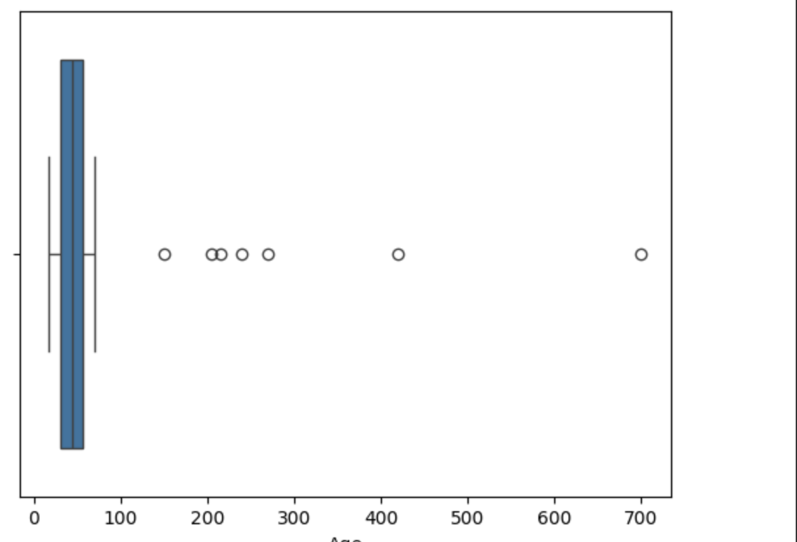
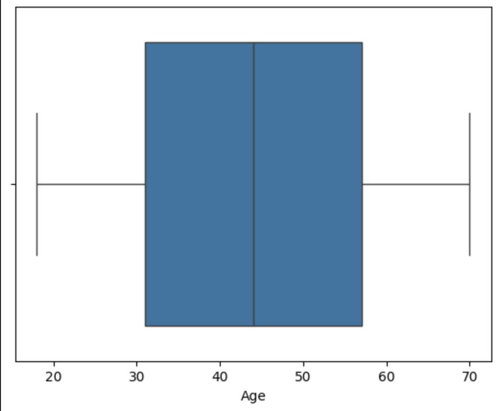
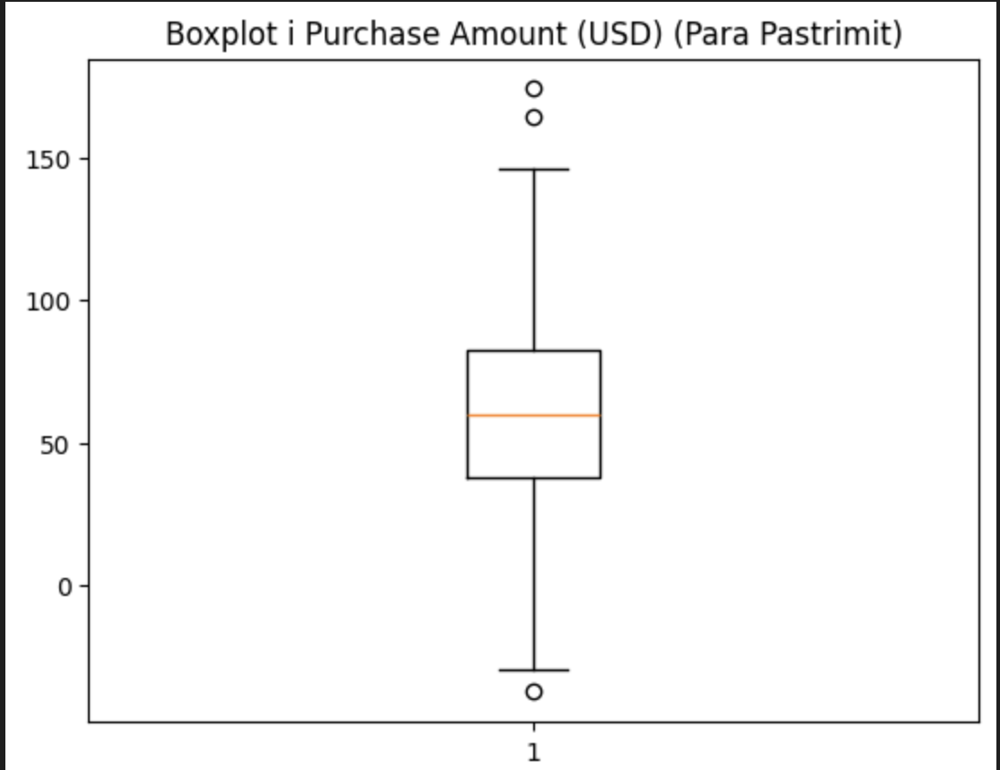
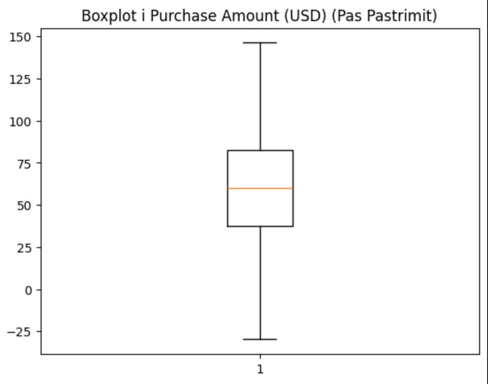
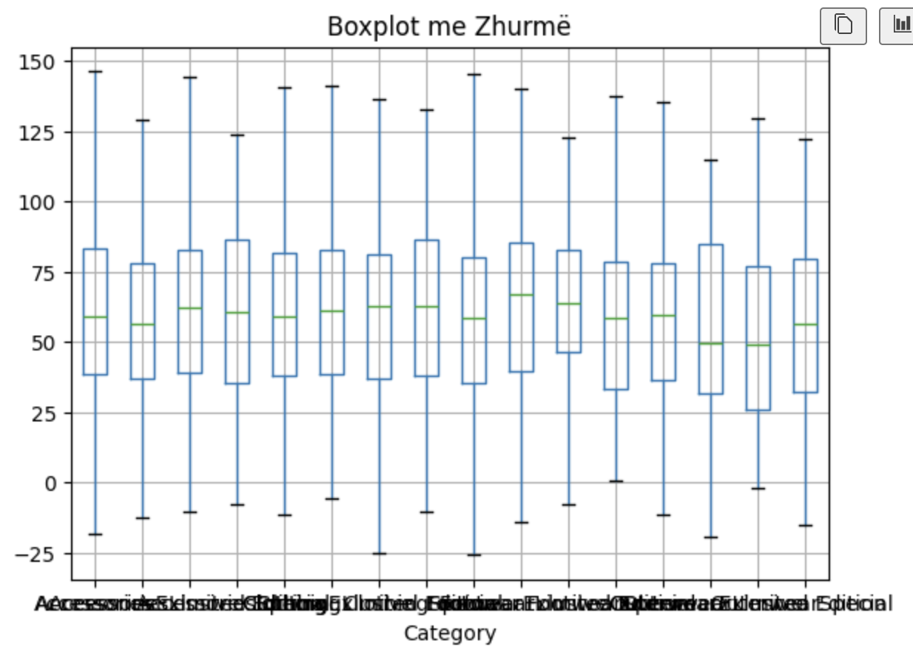
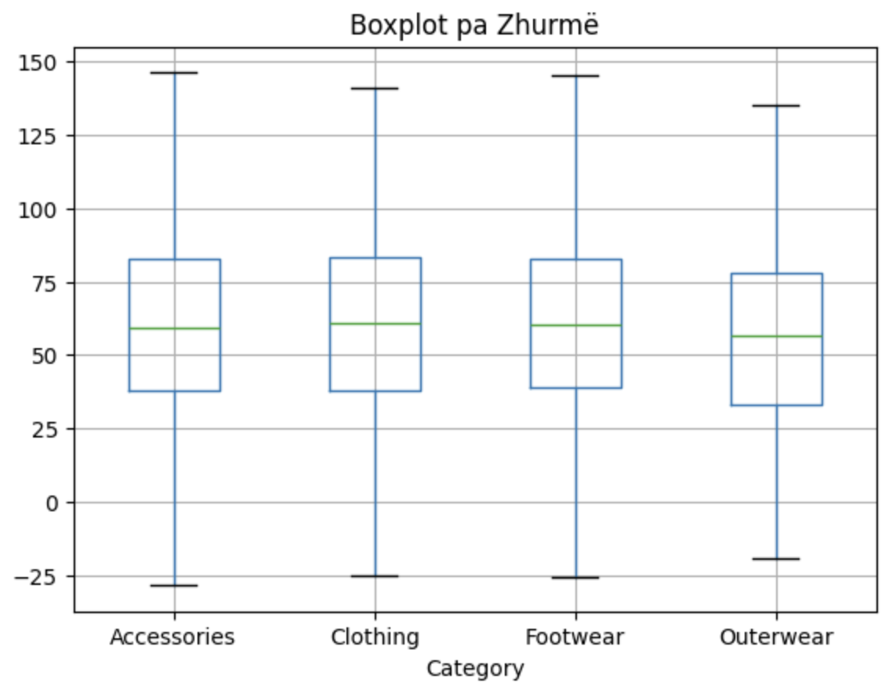

# Customer Shopping Trends Dataset
Ky projekt në lendën: *Përgatitja dhe vizualizimi i të dhënave* analizon "Customer Shopping Trends Dataset", duke ofruar një pasqyrë të thellë mbi sjelljet dhe preferencat e blerjeve të konsumatorëve. Duke përdorur teknika të avancuara të parapërgatitjes dhe analizës së të dhënave, ne synojmë të paraqesim disa ide se si mund ti ndihmojmë bizneset të përshtaten në nevojat e klientëve të tyre. Projektim, ekzekutimi dhe analiza e të dhënave janë bërë me qëllim të përmirësimit të strategjive të marketingut dhe ofertave të bizneseve, duke kontribuar drejt një përvoje më të personalizuar për konsumatorin.

**[Customer Shopping Trends Dataset](https://www.kaggle.com/datasets/iamsouravbanerjee/customer-shopping-trends-dataset/data)** from **[Kaggle](https://www.kaggle.com)**.

## Startimi i projektit
1. Se pari bëni instalimin e python-it në pajisjen e juaj.
2. Klonimi i projektit:  **[Customer Shopping Trends Dataset](https://github.com/BleronaIdrizi/Customer_Shopping_Trends_Visualization)**.
3. Ekzekutimi i komandës për instalimin e librarive në direktoriumin ku është i vendosur projekti:
```python
pip3 install -r requirements.txt
```

## Teknikat e Vizualizimit
- Boxplots për analizën e outliers dhe zhurmës.
- Pie Charts për të paraqitur shpërndarjen gjinore nëpër stinë.
- Grafikë me shtylla për të paraqitur shumat totale të blerjeve sipas kategorisë.

## Disa rezultate tona në priprocesimin e të dhënave
### 1. *Kualiteti i të dhënave*: 
#### 1.1 *Menaxhimi vlerave *null**: 
- Në dataset-in tonë janë gjetur disa lloje të ndryshme të kolonave me vlera *null*.


- Vlerat *null* të kolonës "Age" i kemi trajtuar duke zevëndësuar me moshën mesatare, ndërsa vlerat null të kolonave tjera i kemi injoruar.

#### 1.2 *Menaxhimi i duplikateve*: 
- Në dataset-in tonë i janë gjetur disa duplikate:


- Pas ekzektuimi të komandës për gjetjen e rreshtave duplikat e kemi ekzekutuar komandën për largimin e duplikateve.

#### 1.3 *Menaxhimi i Outliers*: 
- Në dataset-in tonë kolona Age është gjetur si Outlier dhe me përdorimin e paketës seaborn e kemi shfaqur datasetin se si duket me Ouliers:


- Mirepo me përdorimin e metodës Z-Score i kemi larguar Outliers. Rezultati pas largimit të Outliers:


#### 1.4 Menaxhimi i Zhurmës: 
- Në dataset-in tonë janë analizuar dy lloje të kolonave për zhurmë. Kolona e parë është: Purchase Amount. Rezultati i kësaj kolone me zhurmë duke përdorur boxplot është: 


- Mirepo me përdorimin e metodës IQR(Interquartile Range) e kemi larguar zhurmën në këtë kolonë. Rezultati pas largimit të zhurmës:



- Kolona e dytë është: Category. Rezultati i kësaj kolone me zhurmë duke përdorur boxplot është: 



- Me reduktimin e zhurmës në këtë kolonë arrihet ky rezultat:



### 2. Priprocesimi i të dhënave: 
#### 2.1 Reduktimi i dimensionalitetit: 
- Në dataset-in tonë janë përdorur dy kolona për të treguar nëse artikulli ka pasur zbritje dhe nese është përdorur kodi i zbritjës. Përdorimi i njerës afekton tjetrën, kështu që e kemi shtuar një kolonë të re që i përfaqson këto dy kolona, dhe rezultati i dataset-it duket kështu:


#### 2.2 Mostrimi i të dhënave: 
- Ne kemi paraqitur gjininë më të shpeshtë për shitje gjatë stinëve të ndryshme për ta paraqitur mostrimin. Rezultati para mostrimit:


- Ndërsa rezultati pas mostrimit, duke i marrur vetëm 500 rreshta duket kështu:


#### 2.3 Agregimi i të dhënave: 
- Një nga shembujt se si e kemi përdorur agregimin është shuma totale e blerjeve sipas kategorisë:


#### 2.4 Zgjedhja e nën bashkësisë së vetive: 
- Rezultati i arritur në shembullin se si e kemi përdorur zgjedhjen e nën bashkësisë së vetive duket kështu:


#### 2.5 Krijimi i vetive: 
- Rezultati i arritur në shembullin se si e kemi përdorur krijimin e vetive duket kështu:


#### 2.6 Binarizimi: 
- Rezultati i arritur në shembullin se si e kemi përdorur binarizimin duket kështu:


#### 2.6 Transformimi: 
- Rezultati i arritur në shembullin se si e kemi përdorur transformimin duket kështu:


### 3. Krijimi i datasetit të procesuar: 
- Pasi qe e kemi përfunduar priprocesimin e të dhënave, rezultati përfundimtar ruhet tek folderi files me emrin "Preprocessed_Shopping_Trends_Dataset": 


#### 3.1 Kompresimi: 
- Pasi qe e kemi përfunduar priprocesimin e të dhënave e kemi bërë edhe kompresimin e tyre: 


## Kontributi
Blerona Idrizi

Vlora Gjoka