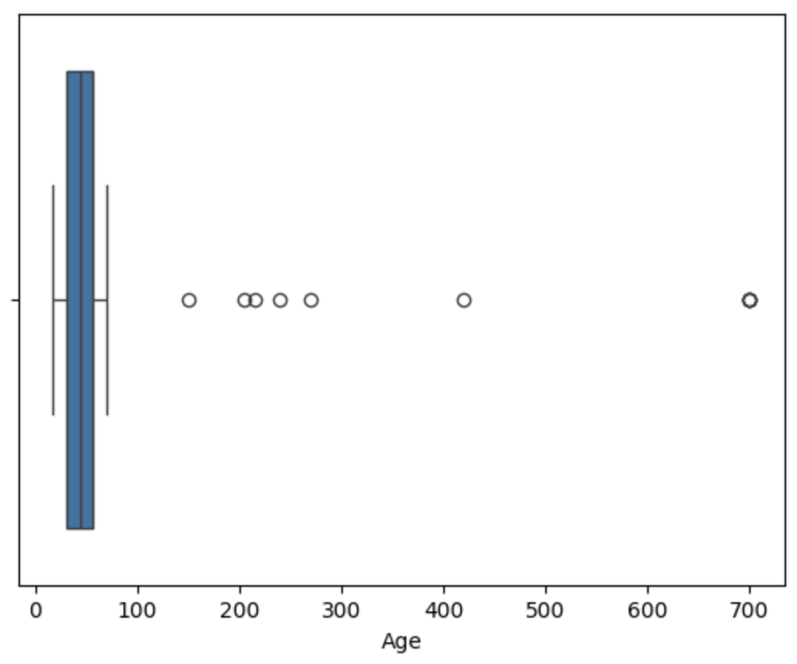
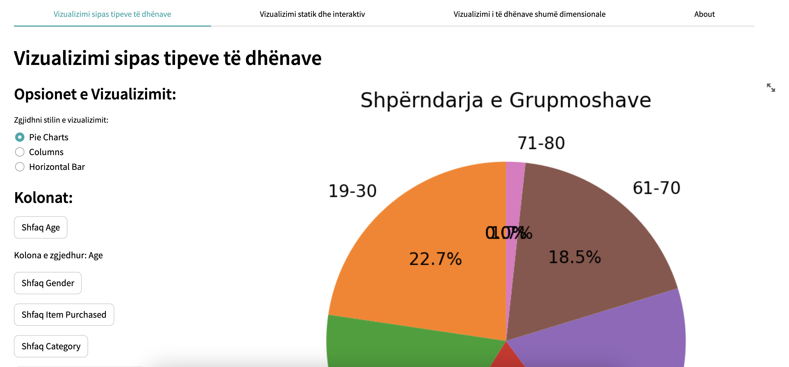
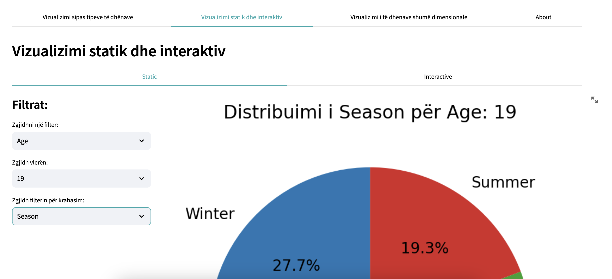

# Customer Shopping Trends Dataset
Ky projekt në lendën: *Përgatitja dhe vizualizimi i të dhënave* analizon "Customer Shopping Trends Dataset", duke ofruar një pasqyrë të thellë mbi sjelljet dhe preferencat e blerjeve të konsumatorëve. Duke përdorur teknika të avancuara të parapërgatitjes dhe analizës së të dhënave, ne synojmë të paraqesim disa ide se si mund ti ndihmojmë bizneset të përshtaten në nevojat e klientëve të tyre. Projektim, ekzekutimi dhe analiza e të dhënave janë bërë me qëllim të përmirësimit të strategjive të marketingut dhe ofertave të bizneseve, duke kontribuar drejt një përvoje më të personalizuar për konsumatorin.

**[Customer Shopping Trends Dataset](https://www.kaggle.com/datasets/iamsouravbanerjee/customer-shopping-trends-dataset/data)** from **[Kaggle](https://www.kaggle.com)**.

## Startimi i projektit
1. Se pari bëni instalimin e python-it në pajisjen e juaj.
2. Klonimi i projektit:  **[Customer Shopping Trends Dataset](https://github.com/BleronaIdrizi/Customer_Shopping_Trends_Visualization)**.
3. Ekzekutimi i komandës për instalimin e librarive në direktoriumin ku është i vendosur projekti:
```python
pip3 install -r requirements.txt
```

## Teknikat e Vizualizimit
- Boxplots për analizën e outliers dhe zhurmës.
- Pie Charts për të paraqitur shpërndarjen gjinore nëpër stinë.
- Grafikë me shtylla për të paraqitur shumat totale të blerjeve sipas kategorisë.

## Tipet e atributeve
1. Kategoriale(Kualitative)
    - Nominale: Gender, Item Purchased, Category, Location, Color, Season, Subscription Status, Shipping Type, Discout Applied, Promo Code Used, Payment Method.
    - Ordinale: Review Rating, Size, Frequency of Purchases.
2. Numerike(Kuantitative)
    - Interval: Age, Previous Purchases.
    - Ratio: Customer ID, Purchase Amount (USD).

## Disa rezultate tona në priprocesimin e të dhënave
### 1. *Kualiteti i të dhënave*: 
#### 1.1 *Menaxhimi vlerave *null**: 
- Në dataset-in tonë janë gjetur disa lloje të ndryshme të kolonave me vlera *null*.


- Vlerat *null* të kolonës "Age" i kemi trajtuar duke zevëndësuar me moshën mesatare, ndërsa vlerat null të kolonave tjera i kemi injoruar.

#### 1.2 *Menaxhimi i duplikateve*: 
- Në dataset-in tonë i janë gjetur disa duplikate:


- Pas ekzektuimi të komandës për gjetjen e rreshtave duplikat e kemi ekzekutuar komandën për largimin e duplikateve.

### 2. Priprocesimi i të dhënave: 
#### 2.1 Reduktimi i dimensionalitetit: 
- Në dataset-in tonë janë përdorur dy kolona për të treguar nëse artikulli ka pasur zbritje dhe nese është përdorur kodi i zbritjës. Përdorimi i njerës afekton tjetrën, kështu që e kemi shtuar një kolonë të re që i përfaqson këto dy kolona, dhe rezultati i dataset-it duket kështu:


#### 2.2 Mostrimi i të dhënave: 
- Ne kemi paraqitur gjininë më të shpeshtë për shitje gjatë stinëve të ndryshme për ta paraqitur mostrimin. Rezultati para mostrimit:


- Ndërsa rezultati pas mostrimit, duke i marrur vetëm 500 rreshta duket kështu:


#### 2.3 Agregimi i të dhënave: 
- Një nga shembujt se si e kemi përdorur agregimin është shuma totale e blerjeve sipas kategorisë:


#### 2.4 Zgjedhja e nën bashkësisë së vetive: 
- Rezultati i arritur në shembullin se si e kemi përdorur zgjedhjen e nën bashkësisë së vetive duket kështu:


#### 2.5 Krijimi i vetive: 
- Rezultati i arritur në shembullin se si e kemi përdorur krijimin e vetive duket kështu:


#### 2.6 Binarizimi: 
- Rezultati i arritur në shembullin se si e kemi përdorur binarizimin duket kështu:


#### 2.6 Transformimi: 
- Rezultati i arritur në shembullin se si e kemi përdorur transformimin duket kështu:


### 3. Krijimi i datasetit të procesuar: 
- Pasi qe e kemi përfunduar priprocesimin e të dhënave, rezultati përfundimtar ruhet tek folderi files me emrin "Preprocessed_Shopping_Trends_Dataset": 


#### 3.1 Kompresimi: 
- Pasi qe e kemi përfunduar priprocesimin e të dhënave e kemi bërë edhe kompresimin e tyre: 


# FAZA 2

## Outliers
Ky seksion përmban hapat e ndërmarrë për identifikimin dhe trajtimin e outliers në setin e të dhënave. Analiza e outliers është e rëndësishme për të siguruar saktësinë dhe cilësinë e modeleve statistikore dhe të nxjerrjes së përfundimeve.

### Shembulli i moshës

Metoda që përdorim për të identifikuar outliers është e bazuar në analizë statistikore, duke përdorur vizualizimin e boxplot. Ky lloj grafiku na ndihmon të shohim vlerat që shfaqen jashtë intervalit të zakonshëm të të dhënave.

```python
import seaborn as sns
import pandas as pd

# Kemi një DataFrame të quajtur 'df' që përmban kolonën 'Age'.
# Për të vizualizuar outliers në moshë, ekzekutojmë këtë kod:

sns.boxplot(df['Age'], orient='h')

# Kështu krijohet një boxplot horizontal që shfaq moshën.
# Vlerat e identifikuara si outliers janë të shënuara me pika të veçanta
# jashtë kutisë qendrore të grafikut.

```
### Analiza e Outliers

 DBSCAN është një algoritem klasifikimi bazuar në dendësi që ndihmon në identifikimin e grupeve (clusters) të dendura me pikat e jashtme si outliers.



#### Procesi i përpunimit të të dhënave dhe aplikimi i DBSCAN

Fillimisht, kemi konvertuar kolonat e nevojshme në vlera numerike dhe kemi selektuar kolonat për grupim. Pastaj kemi standardizuar karakteristikat për të përmirësuar performancën e DBSCAN.

```python
import seaborn as sns
import pandas as pd
from sklearn.preprocessing import StandardScaler
from sklearn.cluster import DBSCAN

# Konverto vlerat në vlera numerike
df['Age'] = pd.to_numeric(df['Age'], errors='coerce')
df['Purchase Amount (USD)'] = pd.to_numeric(df['Purchase Amount (USD)'], errors='coerce')

# Selektimi i kolonave për grupim
X = df[['Age', 'Purchase Amount (USD)']]

# Standardizimi i karakteristikave
scaler = StandardScaler()
X_scaled = scaler.fit_transform(X.dropna())

# Aplikimi i DBSCAN
dbscan = DBSCAN(eps=0.5, min_samples=5)
clusters = dbscan.fit_predict(X_scaled)
```


### Identifikimi i Outliers me KMeans Clustering

KMeans është një algoritem i njohur i grumbullimit që ndan të dhënat në grupe bazuar në ngjashmërinë e tyre.

#### Procesi i përpunimit të të dhënave dhe aplikimi i KMeans

Ne fillim zgjodhëm kolonat e nevojshme dhe pastaj pastruam të dhënat për të hequr vlerat që mungojnë. Pas kësaj, ne inicializuam modelin KMeans me një numër të caktuar të qendrave të grupimeve dhe e trajnuam atë me të dhënat tona të pastruara.

```python
import pandas as pd
from sklearn.cluster import KMeans
from scipy.spatial.distance import cdist
import numpy as np
import plotly.express as px

# Zgjedhja e kolonave të nevojshme nga DataFrame
data_selected = df[['Age', 'Purchase Amount (USD)']]

# Pastrimi i të dhënave dhe përdorimi i KMeans
data_selected_clean = data_selected.dropna()
kmeans = KMeans(n_clusters=3, n_init=10)
kmeans.fit(data_selected_clean)

# Llogaritja e distancës nga qendrat e grupimeve
distanca = cdist(data_selected, kmeans.cluster_centers_, 'euclidean')
distancia_minimale = np.min(distanca, axis=1)
df['distanca_deri_te_qendra'] = distancia_minimale
```


### Identifikimi i Outliers me metodën Z-Score

Në këtë pjesë, kemi përdorur metoden Z-Score për të gjetur dhe larguar outliers në të dhënat e moshës. Metoda Z-Score përdor mesataren dhe devijimin standard për të përcaktuar kufijtë e vlerave normale dhe atyre anomale.

#### Gjetja e kufijve me Z-Score

Për të përcaktuar kufijtë, ne kemi llogaritur mesataren dhe devijimin standard të moshës dhe kemi vendosur kufijtë si mesatare plus ose minus tre herë devijimi standard. Ja si duket kodi i përdorur:

```python
import pandas as pd

# Llogaritja e kufijve të sipërm dhe të poshtëm
upper_limit = df['Age'].mean() + 3*df['Age'].std()
lower_limit = df['Age'].mean() - 3*df['Age'].std()
print('Limiti i sipërm:', upper_limit)
print('Limiti i poshtëm:', lower_limit)
```
#### Largimi i të dhënave që janë përcaktuar si Outliers

Pas identifikimit të outliers me metoden Z-Score, ne kemi vijuar me largimin e tyre nga dataseti për të përmirësuar cilësinë e analizave të mëtejshme.

```python
# Largimi i outliers dhe krijimi i një dataseti të pastër
new_df = df.loc[(df['Age'] <= upper_limit) & (df['Age'] >= lower_limit)]

# Shfaqja e numrit të rreshtave përpara dhe pas largimit të outliers
print('Para largimit të Outliers:', len(df))
print('Pas largimit të Outliers:', len(new_df))
print('Outliers:', len(df) - len(new_df))
```


### Shembulli i analizës së ngjyrave

Në këtë pjesë të analizës, ne kemi shqyrtuar frekuencën e secilës ngjyrë në kolonën e ngjyrave të datasetit tonë. Ky hap është i rëndësishëm për të kuptuar shpërndarjen e të dhënave dhe për të identifikuar ndonjë tendencë ose anomali.

#### Llogaritja dhe vizualizimi i frekuencës së ngjyrave

Ne fillim llogaritëm frekuencën e secilës ngjyrë duke përdorur metoda `value_counts()` dhe më pas e vizualizuam këtë shpërndarje duke përdorur një barplot nga seaborn.

```python
import seaborn as sns
import matplotlib.pyplot as plt

# Llogaritja e frekuencës së secilës ngjyrë
color_counts = df['Color'].value_counts()

# Vizualizimi i frekuencës së ngjyrave
plt.figure(figsize=(10, 6))
sns.barplot(x=color_counts.index, y=color_counts.values)
plt.title("Frekuenca e ngjyrave")
plt.xlabel("Color")
plt.ylabel("Frequency")
plt.xticks(rotation=45)
plt.show()
```


### Largimi i Outliers nga kolona e ngjyrave

Në këtë pjesë, ne kemi trajtuar outliers që janë identifikuar në kolonën e ngjyrave të datasetit tonë. Kemi krijuar një listë të ngjyrave të konsideruara si outliers dhe më pas kemi larguar të gjitha rreshtat ku ngjyra është pjesë e kësaj liste.

#### Procesi i largimit të Outliers

Kemi përdorur listën e ngjyrave outliers për të krijuar një DataFrame të ri pa këto outliers:

```python
# Krijimi i listës së ngjyrave outliers
outlier_colors = potential_outliers.index.tolist()

# Largimi i rreshtave ku 'Color' është në listën e ngjyrave outlier
df = df[~df['Color'].isin(outlier_colors)]
```


## Noisy Data

Pas trajtimit të outliers, një pjesë tjetër kritike e pastrimit të të dhënave është identifikimi dhe trajtimi i të dhënave me zhurmë. Në këtë seksion, kemi shtuar zhurmë të qëllimshme në kolonën numerike për të simuluar të dhënat me zhurmë dhe për të treguar metodat e pastrimit.

### Shtimi i zhurmës në një kolonë numerike

Për të simuluar të dhënat me zhurmë, kemi shtuar vlera të rastësishme nga një shpërndarje normale te vlerat e kolonës 'Purchase Amount (USD)'.

```python
import numpy as np
import pandas as pd

# Vendosja e seed për reproducueshmëri
np.random.seed(42)

# Shtimi i zhurmës
kolona_zhurme = 'Purchase Amount (USD)'
df[kolona_zhurme] = df[kolona_zhurme] + np.random.normal(0, 20, size=len(df))
```


### Vizualizimi i të dhënave me zhurmë

Pas shtimit të zhurmës në të dhënat, është e rëndësishme të kryejmë vizualizime për të vlerësuar ndikimin e zhurmës në të dhënat. Këtu kemi përdorur një boxplot për të paraqitur shpërndarjen e vlerave në kolonën 'Purchase Amount (USD)' pas shtimit të zhurmës.

#### Krijimi i Boxplot

Kodi i mëposhtëm tregon si të dhënat e kolonës së përzgjedhur janë vizualizuar për të identifikuar ndryshimet e shkaktuara nga zhurma:

```python
import matplotlib.pyplot as plt

# Vizualizimi i boxplot për kolonën me zhurmë
plt.boxplot(df[kolona_zhurme])
plt.title(f'Boxplot i {kolona_zhurme} (Para Pastrimit)')
plt.show()
```


### Trajtimi i të dhënave me zhurmë duke përdorur metodën IQR

Një metodë efektive për trajtimin e të dhënave me zhurmë është përdorimi i interquartile range (IQR), e cila ndihmon në identifikimin dhe heqjen e outliers që mund të konsiderohen si zhurmë.

#### Heqja e Outliers me IQR

Fillimisht, kemi llogaritur vlerat e parë dhe të tretë të quartilit (Q1 dhe Q3) dhe më pas kemi përcaktuar kufijtë për outliers si më poshtë:

```python
# Llogaritja e IQR dhe kufijve për outliers
Q1 = df[kolona_zhurme].quantile(0.25)
Q3 = df[kolona_zhurme].quantile(0.75)
IQR = Q3 - Q1
limiti_i_ulët = Q1 - 1.5 * IQR
limiti_i_lartë = Q3 + 1.5 * IQR
```


### Shtimi i zhurmës dhe pastrimi në një kolonë string

Në përpjekjen tonë për të menaxhuar të dhënat me zhurmë, kemi aplikuar një funksion që shton zhurmë në një kolonë string. Kjo metodë simulon të dhënat reale që mund të përmbajnë gabime ose vargje të rastësishme.

#### Shtimi i zhurmës në kolonën "Category"

Kemi përdorur një funksion të përcaktuar paraprakisht për të shtuar zhurmë në kolonën "Category". Kjo zhurmë mund të jetë në formën e kategorive të rastësishme që imitojnë të dhënat jo të sakta.

```python
# Funksioni për shtimin e zhurmës është thirrur këtu
shto_zhurme_ne_kategori(df)
```


### Heqja e të dhënave me zhurmë nga kolona kategorike

Në këtë seksion, ne trajtojmë të dhënat me zhurmë në kolonën kategorike 'Category'. Kemi aplikuar një metodë për të zëvendësuar të dhënat e zhurmshme me një vlerë të zbrazët dhe më pas kemi larguar rreshtat me këto vlera të zbrazëta.

#### Zëvendësimi dhe largimi i të dhënave me zhurmë

Për të larguar të dhënat me zhurmë, fillimisht zëvendësojmë çdo instancë të listës së vlerave të zhurmshme me vlera të zbrazëta, dhe më pas heqim rreshtat që përmbajnë këto vlera të zbrazëta nga DataFrame.

```python
# Zëvendësimi i të dhënave me zhurmë me vlera të zbrazëta
df['Category'] = df['Category'].replace('|'.join(lista_e_kategorive_zhurme), '')

# Largimi i rreshtave ku 'Category' është zbrazët
df = df[df['Category'] != '']
```


### Analiza e SMOTE Algoritmit

Paraqitje e SMOTE Algoritmit:


Paraqitje e datasetit me KMeans algoritmin

Para:


Pas:


### Analiza e Skewness në të dhënat

Në këtë seksion, demonstruam si të analizojmë shpërndarjen e të dhënave që nuk janë simetrike, duke përdorur një shembull të të dhënave të shtrembëruara. Kjo shpërndarje është zakonisht karakteristike e të dhënave reale dhe mund të ndikojë në zbatimin e teknikave statistikore.

Për qëllime demonstrative, kemi gjeneruar një set të dhënash eksponenciale me një shtrembërim të caktuar:

```python
import numpy as np
import seaborn as sns
from scipy import stats
import matplotlib.pyplot as plt

np.random.seed(0)
data = np.random.exponential(scale=2.0, size=1000)

```

Para:


Pas:


# Saktësia e modelit

Për të balancuar të dhënat në një problem të klasifikimit ku ekziston një mospërputhje mes klasave, është përdorur teknika e Synthetic Minority Over-sampling Technique (SMOTE). Kjo teknikë lejon krijimin e mostrave sintetike për klasën minoritare. Ky qasja përmirëson saktësinë e modelit duke siguruar që modeli trajnohet në një mënyrë më të balancuar dhe më të drejtë për të gjitha klasat.


```python
# Pjesa ku ndajmë të dhënat në trajnuese dhe testuese
X_train, X_test, y_train, y_test = train_test_split(X, y, test_size=0.2, random_state=42)

# Zbatimi i SMOTE
smote = SMOTE(random_state=42)
X_resampled, y_resampled = smote.fit_resample(X_train_scaled, y_train)

# Trajnimi i modelit
model = RandomForestClassifier(random_state=42)
model.fit(X_resampled, y_resampled)

# Parashikimi dhe vlerësimi i modelit
predictions = model.predict(X_test_scaled)
print("Accuracy:", accuracy_score(y_test, predictions))
```


# FAZA 3
Në këtë fazë përmes një qasjeve të ndryshme, kemi arritur të kryejmë vizualizimin e të dhënave sipas tipeve të tyre, duke përfshirë një spektër të gjerë të informacionit. Vizualizimi statik dhe interaktiv ka pasqyruar në mënyrë efektive detaje të rëndësishme të të dhënave, duke ofruar një perspektivë të plotë. Po ashtu, kemi eksploruar dhe implementuar teknika të sofistikuara për vizualizimin e të dhënave shumë dimensionale, duke rritur thellësinë e analizës dhe kuptimit të informacionit. Përmes tabs që i kemi shtuar ne mund të shikojmë vizualizimet sipas kërkesave.


## Vizualizimi sipas tipeve të dhënave
Për të përdorur me me efikasitet vizualizimin e të dhënave në këtë projekt, ne kemi paraqitur dy lloje të filterave në anën e majtë të ekranit. Këta filtera të kerkëmit na lejojnë të zgjidhim kolonën e dëshiruar për të shfaqur më shumë informacion, duke personalizuar pamjen tuaj të të dhënave. Përveç kësaj, keni mundësinë të përcaktoni tipin e vizualizimit nëpërmjet grafikëve pie charts, horizontal, dhe vertikal. Filterat e kolonave në anën e majtë janë dinamikisht të ardhura nga kolonat e dataset-it. Për shembull, nëse zgjidhim Age si kolonë, do të mund të shikoni vizualizimin në tre lloje të ndryshme. Kjo sjellje e personalizueshme e vizualizimit ju ofron një eksperiencë të pasur dhe fleksibël për të shfrytëzuar potencialin maksimal të të dhënave tuaja.

Shfaqja e kolonës Age sipas vizualizimit pie charts: 



Ne mund të klikojmë edhe në diagram për të hapur vizualizimin për një pamje më të qartë:


Shfaqja e kolonës Age sipas vizualizimit horizontal: 


Shfaqja e kolonës Age sipas vizualizimit vertikal: 


## Vizualizimi statik dhe interaktiv
Sa i përket këtij lloj të vizualizimit kemi paraqitur vizualizimin statik dhe dinamik. Sa i përket vizualizimit statik ne i kemi kemi shfaqur vizualizim e një vlerës së kolonës kundër një kolonës tjetër. Në vizualizimin tonë statik ne duhet të zgjedhim një kolonë që dëshirojmë ta shohim vizualizimin pastar dinamikisht shfaqen vlerat e asaj kolonës që janë në datasetin tonë. Pasi të zgjedhet vlera e asaj kolone, ne mund ta zgjedhim kolonë tjetër që dëshirojmë ta shohim vizualizimin.

Ne mund ta shohim një shembull se si shfaqet vizualizimi statik. 



Në këtë vizualizim ne mund të shohim se mosha 19 në cilën sezonë porositë më shume sipas datasetit tonë:


Nderësa sa i përket vizualizimit dinamik ne kemi për qëllim të prezantojmë një përvojë interaktive dhe informatike të analizës së të dhënave përmes vizualizimeve të krijuara. Ne duhet të zgjedhim kategorinë e dëshiruar dhe të marrin informacion të detajuar përmes grafikëve të shpërndarjes.


Në një shembull tjetër ne mund të shohim mesataren e shumës së blerjeve në bazë të kategorisë:


## Vizualizimi i të dhënave shumë dimensionale

Te vizualizimi shumë dimensional përdorim teknika të ndryshme për të paraqitur të dhëna me më shumë se dy dimensione. Aplikacioni ynë në Streamlit përfshin:

### Karakteristikat

Aplikacioni ofron opsionet e mëposhtme të vizualizimit:

- **catter Plot**
- **Bar Chart**
- **Line Chart**
- **3D Scatter Plot**
- **Heatmap**

## Përdorimi

Për të përdorur aplikacionin, përdoruesit duhet të zgjedhin llojin e grafikut dhe pastaj të zgjedhin kolonat specifike për boshtet X, Y (dhe Z nëse është një grafik 3D) dhe dimensionin e ngjyrës (nëse është i nevojshëm).

```python
# Pjesa e kodit ku përdoruesit zgjedhin opsionet e vizualizimit
x_axis = st.selectbox('Zgjidh boshtin X', options=df.columns)
y_axis = st.selectbox('Zgjidh boshtin Y', options=df.columns)
z_axis = st.selectbox('Zgjidh boshtin Z për grafikun 3D', options=['None'] + list(df.columns))
color_dimension = st.selectbox('Zgjidh dimensionin e ngjyrës', options=['None'] + list(df.columns))
plot_type = st.selectbox('Zgjidh llojin e grafikut', ['Scatter Plot', 'Bar Chart', 'Line Chart', '3D Scatter Plot'])
```

## Shembuj të përdorimit

### Shembulli 1: Vizualizimi i shumës së blerjeve sipas kategorisë dhe gjinisë
- **Përshkrimi:** Përdorni një 'Bar Chart' me 'Category' si boshtin X, 'Purchase Amount (USD)' si boshtin Y dhe 'Gender' si dimensionin e ngjyrës për të analizuar ndikimin e gjinisë në shumën e blerjeve në kategori të ndryshme.

Rezultati me perdorimin e nje 'Bar Chart'


Nese duam të analizojmë marrëdhënien midis tre dimensioneve të të dhënave: moshës së klientit (Age), shumës së blerjes (Purchase Amount (USD)), dhe vlerësimit të rishikimeve (Review Rating) mundëmi të perdorim '3D Scatter Plot' për vizualizim me të mire. Kjo lloj analize mund të na ndihmojë të kuptojmë nëse ka ndonjë lidhje midis moshës së klientëve, shumës që ata shpenzojnë dhe si ata vlerësojnë produktet.


### Shembulli 2: Analiza e blerjeve sipas vendndodhjes dhe stinës
- **Përshkrimi:** 
Përdorni një 'Heatmap' ku 'Category' dhe 'Shipping Type' janë kolonat e zgjedhura për të zbuluar tendencat e blerjeve në lidhje me preferencat e transportit për çdo kategori të artikujve. Ky lloj vizualizimi do të ndihmojë në zbulimin e marrëdhënieve midis kategorive të ndryshme të produkteve dhe zgjedhjeve të klientëve për transport. 


# FAZA 3 

Kjo fazë përmban përshkrimin dhe kodin e përdorur për vizualizimin e të dhënave shumëdimensionale nga një dataset i dhënë.

## Procesi i Vizualizimit

Vizualizimi përfshin disa hapa kryesorë:

1. Leximi dhe pastrimi i të dhënave
2. Analiza eksploruese
3. Krijimi i vizualizimeve shumëdimensionale
4. Krijimi i vizualizimeve interaktive


### Vizualizimet shumë dimensionale

#### Krijimi i Vizualizimeve

Vizualizimet përfshijnë grafikë të shpërndarjes dhe heatmaps, të cilat paraqesin ndërveprime komplekse midis variablave të ndryshme.

#### Libraritë e Përdorura

```python
import pandas as pd
import matplotlib.pyplot as plt
import seaborn as sns
```

#### 1. Grafik i shpërndarjes për mosha vs Shuma e blerjes
Ky grafik i shpërndarjes tregon marrëdhënien midis moshës dhe shumës së blerjes me ngjyrat që diferencojnë gjininë. Përmes tij, shihet si ndryshon shpenzimi në varësi të moshës dhe gjinisë së klientit.

```python
sns.scatterplot(x='Age', y='Purchase Amount (USD)', hue='Gender', data=new_df)
plt.title('Mosha vs Shuma e blerjes sipas gjinisë')
plt.xlabel('Mosha')
plt.ylabel('Shuma e blerjes (USD)')
plt.show()
```

#### 2. Grafik i shpërndarjes - Numri i blerjeve të mëparshme vs Shuma e blerjes
Ky grafik tregon ndikimin e numrit të blerjeve të mëparshme në shumën e blerjes, duke u fokusuar në ndikimin e kategorisë së produktit. Ngjyrat ndihmojnë në identifikimin e kategorive të ndryshme të produkteve.

```python
sns.scatterplot(x='Previous Purchases', y='Purchase Amount (USD)', hue='Category', data=new_df)
plt.title('Numri i blerjeve të mëparshme vs Shuma e blerjes sipas kategorisë')
plt.xlabel('Numri i blerjeve të mëparshme')
plt.ylabel('Shuma e blerjes (USD)')
plt.show()
```


#### 3. Heatmap për marrëdhënien midis vlerësimit të rishikimit dhe mosha
Ky heatmap tregon ndërvarësinë midis grupit të moshës së klientit dhe vlerësimit të tyre të rishikimit. Çdo qeli përfaqëson frekuencën e kombinimeve specifike të moshës dhe vlerësimit të rishikimit.

```python
age_bins = pd.cut(new_df['Age'], bins=[0, 20, 40, 60, 80])
review_rating_vs_age = pd.crosstab(age_bins, new_df['Review Rating'])
sns.heatmap(review_rating_vs_age, annot=True, fmt="d", cmap="YlGnBu")
plt.title('Marrëdhënia midis vlerësimit të rishikimit dhe mosha')
plt.xlabel('Vlerësimi i rishikimit')
plt.ylabel('Mosha')
plt.show()
```

#### 4. Heatmap për marrëdhënien midis kategorisë dhe llojit të transportit
Ky heatmap ilustron marrëdhënien midis kategorisë së produktit dhe llojit të transportit të zgjedhur. Tregon se cilat metoda transporti janë më të zakonshme për çdo kategori të ndryshme të produktit.

```python
category_vs_shipping = pd.crosstab(new_df['Category'], new_df['Shipping Type'])
sns.heatmap(category_vs_shipping, annot=True, fmt="d", cmap="BuPu")
plt.title('Marrëdhënia midis kategorisë dhe llojit të transportit')
plt.xlabel('Lloji i transportit')
plt.ylabel('Kategoria')
plt.show()
```

### Vizualizimi interaktiv 
#### Vizualizimi interaktiv i mesatares së shumës së blerjes sipas kategorisë me HoverTool

Kjo pjesë përmban përshkrimin dhe kodin e përdorur për vizualizimin interaktiv të mesatares së shumës së blerjes për çdo kategori të produktit në datasetin e dhënë, duke përdorur Bokeh dhe HoverTool për interaktivitet.

#### Libraritë e Përdorura

```python
from bokeh.plotting import figure, show, output_notebook
from bokeh.models import ColumnDataSource, HoverTool
from bokeh.transform import dodge
import pandas as pd
```

#### Procesi i Vizualizimit

1. Përgatitja e të dhënave për vizualizim.
2. Krijimi i grafikut me Bokeh dhe shtimi i interaktivitetit përmes HoverTool.
3. Shfaqja e grafikut në Jupyter Notebook ose mjedis tjetër të përshtatshëm.

#### Kod për Vizualizimin

```python
# Përgatitja e të dhënave për vizualizim
grouped_data = new_df.groupby('Category')['Purchase Amount (USD)'].mean().reset_index()
source = ColumnDataSource(grouped_data)

# Vendosja për shfaqjen e grafikut në notebook
output_notebook()

# Krijimi i grafikut
p = figure(x_range=grouped_data['Category'], width=800, height=400, title="Mesatarja e shumës së blerjes sipas kategorisë",
           x_axis_label='Kategoria', y_axis_label='Mesatarja e shumës së blerjes (USD)')

# Shtimi i shtyllave në grafik
p.vbar(x=dodge('Category', -0.25, range=p.x_range), top='Purchase Amount (USD)', width=0.2, source=source,
       color="skyblue")

# Shtimi i mjetit HoverTool për të shfaqur detajet kur mausi vendoset mbi shtyllat
hover = HoverTool()
hover.tooltips = [("Kategoria", "@Category"), ("Mesatarja e shumës", "@{Purchase Amount (USD)}")]
p.add_tools(hover)

# Shfaqja e grafikut
show(p)
```


# Kontributi
Blerona Idrizi

Vlora Gjoka